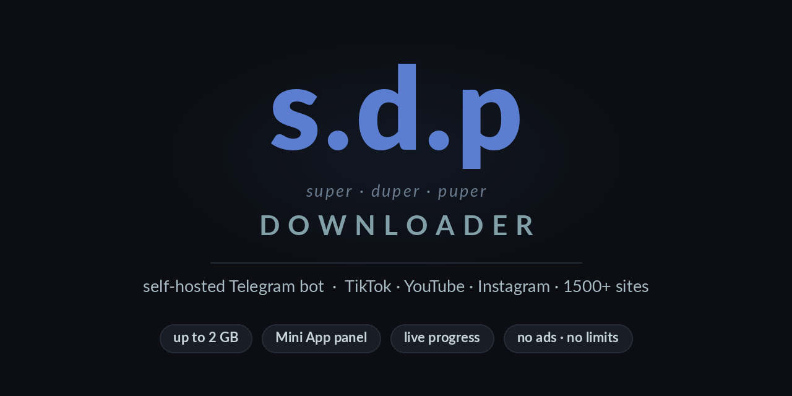
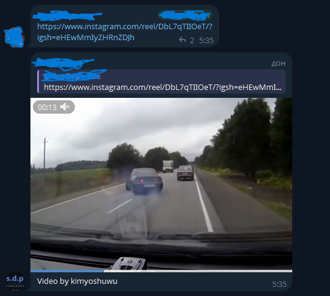
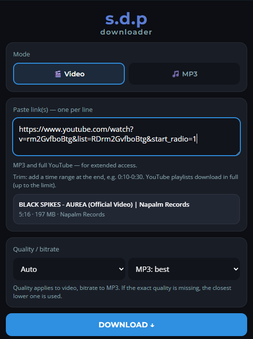
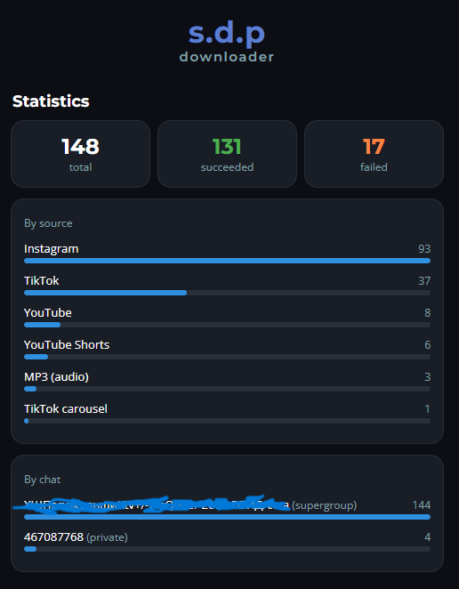
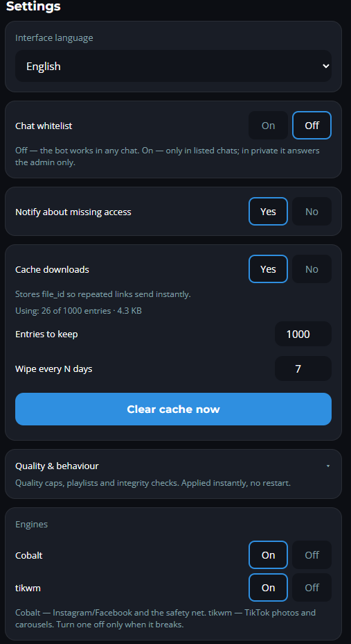
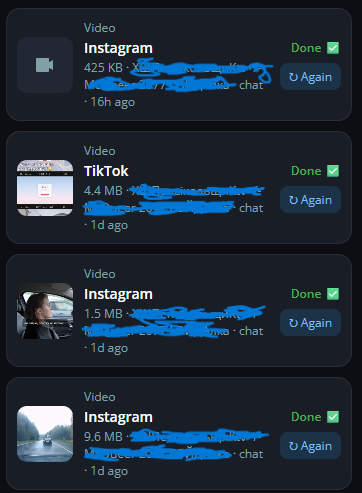
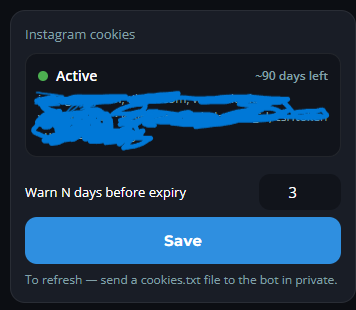
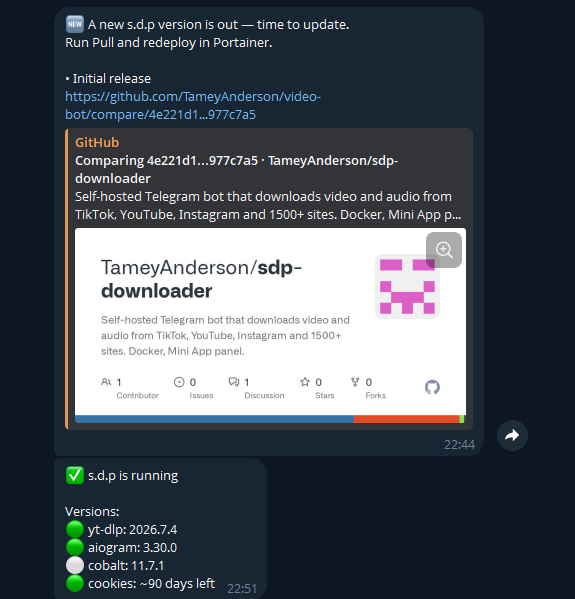
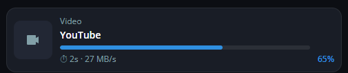

<p align="center">
  
</p>

<p align="center">
  Self-hosted Telegram-бот, який перетворює силки на відео просто в чаті.<br>
  TikTok · YouTube · Instagram · Facebook · 1500+ сайтів
</p>

<p align="center">
  <a href="README.md">English</a> · <b>Українська</b>
</p>

<p align="center">
  <a href="../../actions/workflows/ci.yml"></a>
  
  
  
  <a href="../../pkgs/container/sdp-downloader"></a>
</p>

---

Кидаєш силку в чат — бот відповідає готовим відео. Без реклами, без квот,
без чужих серверів: усе крутиться у тебе, і ніхто не бачить, що ти качаєш.

<p align="center">
  
</p>

## Чому не черговий бот-качалка

**Він не присилає биті файли.** Три рушії з різними ролями (`yt-dlp`, Cobalt, tikwm)
і ланцюжок фолбеків: якщо один віддав обрізане, німе або «фото замість відео» —
пробується наступний. Перед відправкою файл перевіряється на цілісність:
чи не обірвалось завантаження, чи є відеопотік, чи довший він за пів секунди,
чи декодується, чи є звук. Не пройшов — користувач цього навіть не побачить.

**Ним керуєш із телефона.** Mini App — це не вітрина: там прогрес-бари з відсотками
й ETA, статистика, білі списки, cookies і 25 параметрів, які змінюються **наживо**,
без перезапуску контейнера.

**Він не потребує уваги.** Сам стежить за новими версіями `yt-dlp`, aiogram, Cobalt
і власного репозиторію, нагадує оновити cookies за кілька днів до кінця сесії,
перезапускається сам, якщо завис.

## Дві версії

| | **Lite** | **Full** |
|---|---|---|
| Контейнери | 2 | 6 |
| Налаштувати треба | `BOT_TOKEN` — і все | токен, тунель, api_id/api_hash |
| Де працює | тільки в групах | групи + приват + панель |
| Що качає | короткі відео | + повний YouTube, MP3, плейлисти, обрізка, 1500+ сайтів |
| Ліміт файлу | 50 МБ | **2 ГБ** |
| Mini App | немає | є |
| Пише на диск | **нічого** | SQLite: статистика, налаштування, доступи |
| Керування | змінними | кнопками в панелі |

**Lite** — «кинув у групу і забув». **Full** — коли хочеться панелі, великих файлів
і музики. Код і образ одні й ті самі, різниця лише в тому, який compose запускаєш.
Перейти з Lite на Full можна будь-коли: Lite нічого не зберігає, втрачати нема чого.

## Швидкий старт

Спершу — бот у [@BotFather](https://t.me/BotFather): `/newbot`, скопіювати токен,
далі **обов'язково** `/setprivacy` → вибрати бота → **Disable**, інакше він
не бачитиме повідомлень у групах.

### Lite

Два файли, без клонування й без збірки — образ уже готовий:

```bash
curl -O https://raw.githubusercontent.com/TameyAnderson/sdp-downloader/main/docker-compose.lite.yml
curl -o .env https://raw.githubusercontent.com/TameyAnderson/sdp-downloader/main/.env.lite.example
# встав свій BOT_TOKEN у .env
docker compose -f docker-compose.lite.yml up -d
```

Додай бота в групу — і все, він уже працює.

### Full

```bash
curl -O https://raw.githubusercontent.com/TameyAnderson/sdp-downloader/main/docker-compose.yml
curl -o .env https://raw.githubusercontent.com/TameyAnderson/sdp-downloader/main/.env.example
# встав свій BOT_TOKEN у .env
docker compose up -d
```

Mini App і ліміт 2 ГБ вмикаються профілями — див. [нижче](#великі-файли-до-2-гб).

### Portainer

**Stacks → Add stack → Repository**, шлях `docker-compose.yml`
(або `docker-compose.lite.yml`), у **Environment variables** додати `BOT_TOKEN`.
Далі **Deploy the stack**.

## Що вміє

### Завантаження

- **19 сервісів** у реєстрі: YouTube, TikTok, Instagram, Facebook, Twitch,
  SoundCloud, Bandcamp, Twitter/X, Reddit, Pinterest, Tumblr, Snapchat, Bluesky,
  Vimeo, Dailymotion, Bilibili та інші. Кожен вмикається окремо.
- **All-in** — один тумблер, і бот бере будь-який сайт із тих 1500+, що підтримує `yt-dlp`.
- **Плейлисти** (відео або mp3), **обрізка за таймкодами** (`0:10-0:30` поруч із силкою).
- **Музика**: YouTube Music, SoundCloud, Bandcamp — аудіофайлом з тегами.
  Spotify і Deezer читають публічну назву треку й шукають збіг на YouTube
  (без обходу DRM).
- **Трек окремим MP3** до коротких відео — коли музика під роликом цікавіша за
  сам ролик. Доріжка ріжеться з уже завантаженого файлу, тож другого запиту не потребує.
- **Фото-пости й фото-каруселі**: пост із картинками замість відео надсилається
  альбомом, а не оголошується невдачею.
- Сходинки якості 4K → 2K → 1080 → 720 і вибір якості та бітрейту вручну.

### Панель (Mini App)

<table>
<tr>
<td width="33%"></td>
<td width="33%"></td>
<td width="33%"></td>
</tr>
<tr>
<td align="center"><sub>Авто-прев'ю: назва, тривалість і розмір ще до завантаження</sub></td>
<td align="center"><sub>Статистика за джерелами й чатами</sub></td>
<td align="center"><sub>Налаштування наживо — без перезапуску</sub></td>
</tr>
</table>

<table>
<tr>
<td width="33%"></td>
<td width="33%"></td>
<td width="33%"></td>
</tr>
<tr>
<td align="center"><sub>Історія з розміром, мініатюрою і повтором у тап</sub></td>
<td align="center"><sub>Cookies: скільки днів лишилось, одним поглядом</sub></td>
<td align="center"><sub>Сам скаже, коли вийде нова версія</sub></td>
</tr>
</table>

<p align="center">
  <br>
  <sub>Живий прогрес: відсотки, швидкість, час до кінця</sub>
</p>

- Прогрес-бари з відсотками, швидкістю й часом до кінця.
- Історія із розміром, мініатюрою і **повтором у один тап**.
- Авто-прев'ю: вставив силку — одразу видно назву, тривалість, розмір.
- Усі налаштування наживо: 19 числових параметрів і 6 тумблерів.
- Бекап бази однією кнопкою — файл приходить у чат.
- Українська й англійська, перемикаються на льоту.

### Надійність

- Обробка ліміту Telegram (429) з очікуванням і повтором, троттл на чат.
- Ліміти проти зловживань: силок з одного повідомлення, паралельних завантажень
  на користувача й загалом.
- `/health` + Docker healthcheck + `autoheal` — завислий бот перезапускається сам.
- Канал `yt-dlp` `stable | nightly | master` — зламані екстрактори лікуються
  до офіційного релізу.
- **Причина невдачі називається**: закритий пост, вікове обмеження, геоблок,
  видалений пост чи змінена розмітка сайту — а не одне повідомлення на все.
- **Дедлайн на завдання**, щоб посилання, яке падає повільно, не тримало слот,
  і **пауза на рушій**, який кілька разів поспіль упав на тій самій платформі.
- **Однакове посилання, кинуте двома одночасно**, завантажується один раз.
- **Самоперевірка на старті**: ffmpeg, Cobalt, провайдер PO-токенів, справжній
  ліміт файлу — і чи увімкнена приватність у групах, бо саме через неї бот
  зазвичай виглядає мертвим у чаті.
- **Акуратна зупинка**: на `docker stop` активні завантаження встигають
  дійти, а залишки від попереднього запуску прибираються при старті.
- **Відновлення з копії**: надішли `.db` боту в приват. Файл перевіряється до
  того, як щось замінити, а стара база зберігається поруч.

## Налаштування

Майже все крутиться в панелі й зберігається в базі. Змінні в `.env` —
це **стартові значення** для нового деплою. Повний список із поясненнями —
у [`.env.example`](.env.example) (Full) і [`.env.lite.example`](.env.lite.example) (Lite).

Обов'язкова одна: `BOT_TOKEN`. Решта має робочі значення за замовчуванням.

### Хто має доступ

Один білий список чатів і тумблер:

- **вимкнено** (за замовчуванням) — бот працює в будь-якому чаті;
- **увімкнено** — тільки в чатах зі списку, а в приваті відповідає лише адміну.

Рівнів доступу немає: кому дозволено — тому доступно все. Панель завжди лише в адміна.

> У Lite бот працює тільки в групах, а список задається змінною `ALLOWED_CHATS`.
> Якщо бот публічний — заповни її, інакше його зможе додати до себе будь-хто
> і вантажити відео твоїм сервером.

### Cookies для Instagram (необов'язково)

Instagram не віддає частину постів без логіну. З cookies `yt-dlp` тягне їх
і автоматично стає першим рушієм для Instagram та Facebook.

У Full достатньо **надіслати файл `cookies.txt` боту в приват** — він перевірить,
збереже з правами `600` і видалить повідомлення. Стан видно в панелі:
скільки днів лишилось, які ключі, коли оновлено. Бот нагадає заздалегідь.
У Lite файл лише монтується з хоста, надіслати його не можна.

> **Файл cookies = ключ від акаунта**: вхід без пароля й 2FA. Заведи **окремий**
> акаунт, не основний, і ніколи не клади цей файл у git — `.gitignore` вже
> прикриває всі варіанти назв.

### Великі файли (до 2 ГБ)

Звичайний Telegram-бот не надішле файл більший за 50 МБ. Локальний Bot API
знімає це обмеження до 2 ГБ. **Ні домену, ні відкритих портів для цього не
треба** — сервер працює поруч із ботом усередині Docker і назовні не виходить.

1. Візьми `api_id` / `api_hash` на [my.telegram.org](https://my.telegram.org)
   (безкоштовно, зі свого особистого акаунта Telegram, не з бота).
2. Увімкни сервіс: `COMPOSE_PROFILES=bigfiles`.
3. Разовий `logOut` для бота, після чого постав
   `TELEGRAM_API_URL=http://telegram-bot-api:8081` і `MAX_FILE_SIZE_MB=2000`.

`logOut` переносить бота з хмарних серверів Telegram на твій власний. Це дорога
в один бік: щоб повернутись, доведеться спершу зробити `logOut` уже з локального
сервера. Файли лягають на volume, тож заклади під них місце на диску.

### Mini App

Панель — це Telegram Web App, а Web App Telegram відкриває **тільки по HTTPS
із дійсним сертифікатом**. Просто IP-адреса не підійде, тож потрібна адреса —
звідси й домен. Два варіанти:

**Зі своїм доменом (рекомендую).** Підійде будь-який дешевий, головне — додати
його в Cloudflare (безкоштовного тарифу вистачає). Створюєш named-тунель
у Cloudflare Zero Trust, токен кладеш у `CLOUDFLARE_TUNNEL_TOKEN`, а Public
Hostname на кшталт `bot.твійдомен.com` спрямовуєш на `http://video-bot:8080`.
Адреса не змінюється, тож Menu Button у BotFather налаштовується один раз.

**Без домену (щоб просто спробувати).** Cloudflare quick tunnel безкоштовно дає
випадкову адресу `*.trycloudflare.com` — заміни рядок `command:` у сервісі
`cloudflared`, як показано в compose. Мінус: ця адреса змінюється при кожному
перезапуску, і Menu Button доводиться оновлювати щоразу.

Далі `WEBAPP_ENABLED=1`, профіль `miniapp` і Menu Button у BotFather.

Відкривати порти на роутері не треба: `cloudflared` сам зʼєднується назовні
з Cloudflare.

Тунель **вхідний**: він відкриває доступ до панелі ззовні й ніяк не впливає
на те, з якої адреси бот ходить у мережу.

## Оновлення

Бот сам стежить за новими версіями й пише адміну — з описом змін і посиланням на diff.
Оновитись:

```bash
docker compose pull && docker compose up -d
```

У Portainer — **Pull and redeploy** із увімкненим Re-pull image.

Образ публікується під `linux/amd64` і `linux/arm64`, тож Raspberry Pi чи
ARM-VPS працюють так само.

| Тег | Що це |
|---|---|
| `:latest` | найсвіжіший реліз — з'являється, коли запушено тег `v*` |
| `:edge` | поточний стан `main`, перезбирається на кожен push |
| `:v1.0` | фіксована версія, яка не поїде під тобою |

Щоб перемкнути, не редагуючи compose, задай `SDP_IMAGE` — це рятує в Portainer,
де стек із Git-репозиторію не редагується вручну:

```
SDP_IMAGE=ghcr.io/tameyanderson/sdp-downloader:edge
```

За замовчуванням він стежить за апстрімом. Свій форк — `GITHUB_REPO=твій/форк`,
не турбувати взагалі — `GITHUB_REPO=off`. Токен потрібен лише для приватного репозиторію.

## Як воно влаштоване

Схема з рушіями, перевірками й контейнерами — в [ARCHITECTURE.uk.md](ARCHITECTURE.uk.md).

## Розробка

```bash
cd tests && python -m unittest discover -s . -p "test_*.py" -v
```

Правила внеску — у [CONTRIBUTING.uk.md](CONTRIBUTING.uk.md).

51 тест на стандартній бібліотеці, без залежностей: детекція силок, живі параметри,
LITE-режим, двомовність, конфіги деплою й пошук секретів. Те саме ганяє CI
на кожен push. Деталі — у [tests/README.uk.md](tests/README.uk.md).

## Безпека

Бот запускає завантажувач по посиланнях, які йому дають сторонні люди, тож
кілька речей закриті типово. Жодну з них налаштовувати не треба.

- **Не під root.** Контейнер стартує під root рівно настільки, щоб передати
  `/data` непривілейованому користувачу, і одразу знижує права. Наявний том
  переоформлюється сам, тож оновлення нічого від тебе не потребує.
- **Посилання у власну мережу відхиляються.** Інакше лінк, кинутий у групу, міг
  би навести завантажувач на панель твого роутера, сусідній контейнер або
  службу метаданих, яка віддає облікові дані кожному, хто спитає зсередини.
  Власні Cobalt і Bot API лишаються доступними. Якщо свідомо качаєш зі своєї
  мережі — постав `ALLOW_PRIVATE_HOSTS=1`.
- **Секрети можуть лежати у файлах.** Усе, що в оточенні, читає кожен, хто може
  виконати `docker inspect`, а Portainer показує це відкритим текстом. Вкажи
  `BOT_TOKEN_FILE` чи `GITHUB_TOKEN_FILE` — файл матиме перевагу.
- **API панелі має рейт-ліміт** на кожного відвідувача, тож підписану
  `initData` не можна прокрутити в циклі за весь час її життя.
- **Cookies — це облікові дані.** Файл зберігається з вузькими правами, а
  повідомлення, яким ти його надіслав, видаляється з чату. Бери окремий
  акаунт: файл cookies — це вхід без пароля й 2FA.

## Обмеження

- Telegram не дає ботам надсилати файли > 50 МБ (або > 2 ГБ з локальним Bot API).
- Instagram інколи відмовляє анонімним запитам із будь-якої адреси — лікується cookies.
- Фото-каруселі TikTok тримаються на публічному API tikwm; якщо він зникне,
  ця конкретна можливість відвалиться.
- Проксі не вирішує проблем Instagram: причина відмов — відсутність логіну, а не адреса.

## Ліцензія

[MIT](LICENSE). Форкай, дороблюй, використовуй у своїх проєктах — єдина умова
лишити згадку про автора й текст ліцензії.

## Подяки

Проєкт стоїть на плечах [yt-dlp](https://github.com/yt-dlp/yt-dlp),
[cobalt](https://github.com/imputnet/cobalt), [aiogram](https://github.com/aiogram/aiogram)
і [bgutil-ytdlp-pot-provider](https://github.com/Brainicism/bgutil-ytdlp-pot-provider).
